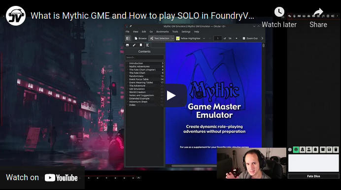

   
# Mythic GME Tools for FoundryVTT

Mythic GM Emulator is an RPG ruleset designed for unprepared GMs, playing without GM at all, or solo players.

It is a system agnostic module meant to be played together with your favorite RPGs.

Mythic GME Tools provides the Macros and Tables for Playing the Mythic GM Emulator series in Foundry VTT.

Below you can find detailed instructions and features for how to play and use this module.

### [Invite me to a Coffee](#by-jeansenvaars) :) if you enjoy my work!

# Table of Contents
1. [What is Mythic - Video](#what-is-mythic-video)
2. [Word Mill Games - License](#word-mill-games)
3. [Features](#features)
   1. [Overview](#overview)
   2. [Macros](#macros)
      1. [GM Emulator Blue Book](#gm-emulator-blue-book)
      2. [Variations 1 Orange Book](#variations-1-orange-book)
      3. [Variations 2 Green Book](#variations-2-green-book)
   3. [The Mighty Chat](#the-mighty-chat)
   4. [Customizing your playstyle](#customizing-your-playstyle)
   5. [Roll Tables](#roll-tables) 
   6. [Saved Progress](#saved-progress)
   7. [Configurable Settings](#configurable-settings)
   8. [Card Decks](#card-decks)
4. [Author](#author)
5. [My other modules](#my-other-modules)
6. [License](#license)

## What is Mythic Video

## Word Mill Games

**Mythic GM Emulator Rulebook** is _REQUIRED_ to use and understand this content. Variations 1 and 2 books are needed for
the optional rules!.

All attributions belong to [Word Mill Games](https://www.wordmillgames.com) and this module is redistributed with appropriate permission from author **Tana Pigeon** - And may NOT be REDISTRIBUTED FURTHER without CONSENT

[Get Mythic GME Book](https://www.drivethrurpg.com/product/20798/Mythic-Game-Master-Emulator)

[Other fantastic Word Mill Games material](https://www.drivethrurpg.com/browse/pub/480/Word-Mill)

## Features

### Overview

* One-Click Macros for Mythic GME basic components: Fate Charts, Scene Alteration, Events and Chaos Level
* **Mythic Variations #1** Macros for Complex Questions and Backstory Generation plus selectable themed focus tables
* **Mythic Variations #2** Macros for Event Checks, Detail and Action questions, Behavior checks and Statistic Checks!
* Saves progress for Chaos Level, Behavior Disposition, Statistic Checks
* Customize all Roll Tables and the Macros will automatically use them!
* Built-in Support for **Dice so Nice!** taking 3D dice to a flavor-narrative oriented experience
* All Actions translate into the chat for keeping a log and **history of your game**

### Macros
These macros provide complex functionalities summarized in a one-click event.
Most of them bring up a Dialog in which the player customizes or elaborates the event.

Selecting a Token will cause the Macros to interact with a Foundry VTT actor, 
speak on his behalf or even sometimes use its information for better flavor!

#### GM Emulator Blue Book
* Fate Chart: Rolls on the Fate Chart. Triggers Random Events when appropriate.
* Random Event: Generates a random event.
* Scene Alteration: Checks if the proposed event is still valid. Rolls Random Events when appropriate.
* Increase Chaos Rank
* Decrease Chaos Rank

#### Variations 1 Orange Book
* Complex Questions
* Backstory Generator

#### Variations 2 Green Book

* Fate Check
* Event Check
* Detail Check
* Description Question
* Action Question
* Behavior Check - Advanced: This Macro stores disposition information within Tokens!
* Statistic Check - Advanced: This Macro stores the last used Attributes in your game!

### The mighty chat

### Customizing your playstyle

**Macros use Roll Tables**. Going to **Module Settings** lets you choose which tables are being used. Table names must begin
with **Mythic** in order to be eligible. By default, Macros pick up Tables **by their name**, so also importing the  Tables
from the Compendium and making modifications on them, will automatically apply to the Macros looking for them.
Try to keep the same format of the tables to avoid issues. Delete imported tables to revert Macros to use the original ones.

### Roll Tables

* All Tables that are necessary to execute the aforementioned macros are included and may also be used independently.

### Saved Progress

* Chaos Rank: When changing Chaos Rank, the value will be saved and reused across all functions
* Behavior Actor Disposition: Tokens and Actors on which Behavior Check was used, will save their information in your game.
Running Behavior Checks on the same tokens will bring up their current disposition data!
* Statistic Checks Macro will store the last utilized Attributes for more convenience playthrough!

### Configurable Settings
* Minimum and Maximum Chaos Rank is configurable
* Customizable Chaos Level range
* Custom color for Chaos Die in Variations #2
* Optional setting rules from Variations #1 and #2
* Define your own default tables for Subject, Adverb and Adjective tables

### Card Decks

**NOTE** - Deck Images are not included and can be purchased from DriveThruRPG or similar outlets.

#### Overview

* Includes presets for GME Deck, TAC Deck and the GMA Decks
* Configure your Deck folder for the Macros to be able to pull them into the game (See instructions below)
* Optionally rotate cards feature (Mythic and TAC need this) - **Note: Must be changed within the Macro Script**
* Toggle shuffle off if required - **Note: Must be changed within the Macro Script**
* Set image file type to match your card image files. - **Note: Must be changed within the Macro Script**
  

#### How to use

1. Install and Enable Mythic GME Tools in FoundryVTT
2. Enter any game (This module is system agnostic!)
3. Go to Compendiums, right click on Mythic GME Macros, Import All Content
4. Roll Tables can be used either directly from the Compendium, or imported along your other Roll Tables
5. [Optional] Using Decks (Cards not included) - Thank you stargolum/spacegiant) !!!
    1. Get a copy of
       cards [Mythic GME Cards](https://www.drivethrurpg.com/product/257195/Mythic-Game-Master-Emulator-Deck)
       or [TAC Cards](https://www.drivethrurpg.com/product/125685/The-GameMasters-Apprentice-Base-Deck) (check the macro
       list for a precise list of supported decks)
    2. Download the ZIP files of the decks you want to use
    3. Go to the folder "Data" from Foundry. This is where you have folders like `modules`, `systems` and `worlds`.
    4. Create a folder called `decks` exactly there along these other folders.
    5. Go inside the `decks` folder you just created and put the purchased .ZIP file there
    6. Right-click on the ZIP and press "Extract Here". Leave everything as is, make sure no folder names are duplicated
       when you extract it.
    7. Import mythic deck Macros for your preset game (or use these as guidance)
    8. If everything works, you can delete the zip file from there. It is not needed.
5. Say thanks if you like this :)

## Author

This module is developed by me (Saif Ellafi - JeansenVaars) independently, and I hold no business relationship with Word
Mill Games. I (Saif Ellafi / @JeansenVaars) was given PERMISSION by Tana Pigeon to distribute this package UNDER STRICT
CONSENT of non-commercial distribution within Foundry VTT only.

However you can still [Invite me to a Coffee](#by-jeansenvaars) :) if you enjoy my work!

### By JeansenVaars

### Contributors

Thanks to [spacegiant](https://github.com/spacegiant) (GitHub username) - We can enjoy a set of Macros destined to use
Mythic Cards Deck as well as The GameMaster's Apprentice.

The decks **ARE NOT INCLUDED**, thus must be purchased
separately: [Mythic GME Deck](https://www.drivethrurpg.com/product/257195/Mythic-Game-Master-Emulator-Deck)
and [TAC](https://www.drivethrurpg.com/product/125685/The-GameMasters-Apprentice-Base-Deck)

### Community

Special thanks to the Community at the Discord Channel from [Mythic Game Master Emulator](https://discord.gg/hyHUuZEt)
for the support

### Powered By

Thanks to JetBrains I can work on this project using **WebStorm**.

## My other modules!

* [Minimal UI](https://github.com/saif-ellafi/foundryvtt-minimal-ui)
* [Window Controls](https://github.com/saif-ellafi/foundryvtt-window-controls)
* [Terrain Randomizer](https://github.com/saif-ellafi/foundryvtt-terrain-randomizer)
* [Scene Preview](https://github.com/saif-ellafi/foundryvtt-scene-preview)
* [Actor Link Indicator](https://github.com/saif-ellafi/foundryvtt-actor-link-indicator)
* [Super Select](https://github.com/saif-ellafi/foundryvtt-super-select)

## License

[Custom License](./LICENSE.md)
