   
# Mythic GME Tools for FoundryVTT

Mythic GM Emulator is an RPG ruleset designed for unprepared GMs, playing without GM at all, or solo players.

It is a system agnostic module meant to be played together with your favorite RPGs.

Mythic GME Tools provides the Macros and Tables for Playing the Mythic GM Emulator series in Foundry VTT.

### _Created by: JeansenVaars_
[](https://ko-fi.com/V7V14D3AH)

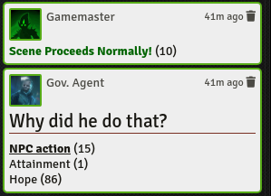

### [This module was made for free, with love, hard work and tons of coffee!](https://ko-fi.com/jeansenvaars)

### Early Special Appreciations!
* **Tana Pigeon** for authorizing the distribution of this module, based on the wonderful Mythic Books
* **stargolum** for DECKs support, feature loved by the community who plays with GMA cards
* **KarstenW** for providing German Translations to the UI
* **FoundryVTT Discord, Die Gießerei and Mythic Discord communities** for supporting with my terrible coding skills and crazy ideas
* All users who say thanks and the ones who secretly play without letting me know :D

# Table of Contents
1. [Word Mill Games - License](#word-mill-games)
2. [How to use](#how-to-use)
3. [Features](#features)
   1. [Overview](#overview)
   2. [Macros](#macros)
      1. [GM Emulator Blue Book](#gm-emulator-blue-book)
      2. [Variations 1 Orange Book](#variations-1-orange-book)
      3. [Variations 2 Green Book](#variations-2-green-book)
      4. [The Crafter Series](#the-crafter-series)
   3. [Mythic Play Journals](#mythic-play-journals)
   4. [The Oracle Builder](#the-oracle-builder)
   5. [Rolling your own Tables](#rolling-your-own-tables)
   6. [Chat and Exporting](#chat-and-exporting)
   7. [Customizing your playstyle](#customizing-your-playstyle)
   8. [Saved Progress](#saved-progress)
   9. [Configurable Settings](#configurable-settings)
   10. [Card Decks](#card-decks)
4. [Tips and Tricks and Modules](#tips-and-tricks-and-modules)
5. [Author](#author)
6. [License](#license)

## Word Mill Games

**Mythic GM Emulator Rulebook** is _REQUIRED_ to use and understand this content. Variations 1 and 2 books are needed for
the optional rules!.

All attributions belong to [Word Mill Games](https://www.wordmillgames.com) and this module is redistributed with appropriate permission from author **Tana Pigeon** - And may NOT be REDISTRIBUTED FURTHER without CONSENT

[Get Mythic GME Book](https://www.drivethrurpg.com/product/20798/Mythic-Game-Master-Emulator)

[Other fantastic Word Mill Games material](https://www.drivethrurpg.com/browse/pub/480/Word-Mill)

## How to Use
This modules provides all mythic rules in the form of Macros. You can use them in whatever RPG system you like in any world.

In Foundry, enable the module, and then go to the Compendiums tab, you are going to see many compendiums starting with the word **Mythic**. For starters, the most basic one is **Mythic GME Macros**, but feel free to explore the others, the more you are familiar with Mythic rules.

Once you open the Compendium, you'll see many Macros like **Fate Chart** or **Scene Alteration**. Simply drag and drop them to your Macro Hotbar at the bottom of the screen. Then, just click on it and play! Organize macros that you use frequently for your type of play. This is how my Macro hotbar looks like:


## Features

### Overview

* One-Click Macros for Mythic GME basic components: Fate Charts, Scene Alteration, Events and Chaos Level
* **Mythic Variations #1** Macros for Complex Questions and Backstory Generation plus selectable themed focus tables
* **Mythic Variations #2** Macros for Event Checks, Detail and Action questions, Behavior checks and Statistic Checks!
* Saves progress for Chaos Level, Behavior Disposition, Statistic Checks
* Customize all Roll Tables and the Macros will automatically use them!
* Built-in Support for **Dice so Nice!** taking 3D dice to a flavor-narrative oriented experience
* All Actions translate into the chat for keeping a **history of your game**. This may also be exported to a Journal.


### Macros
These macros provide complex functionalities summarized in a one-click event.
Most of them bring up a Dialog in which the player customizes or elaborates the event.

Selecting a Token will cause the Macros to interact with a Foundry VTT actor, 
speak on his behalf or even sometimes use its information for better flavor!

#### GM Emulator Blue Book
* Fate Chart: Rolls on the Fate Chart. Triggers Random Events when appropriate.
* Random Event: Generates a random event.
* Scene Alteration: Checks if the proposed event is still valid. Rolls Random Events when appropriate.
* Increase Chaos Rank
* Decrease Chaos Rank
* Check Chaos Rank

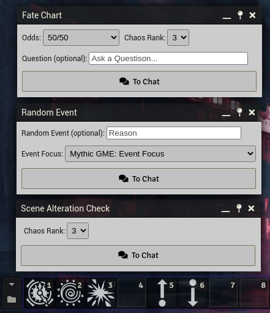

#### Variations 1 Orange Book
* Complex Questions
* Backstory Generator

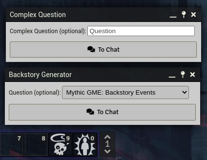

#### Variations 2 Green Book

* Fate Check
* Event Check
* Detail Check
* Description Question
* Action Question
* Behavior Check - Advanced: This Macro stores disposition information within Tokens!
* Statistic Check - Advanced: This Macro stores the last used Attributes in your game!

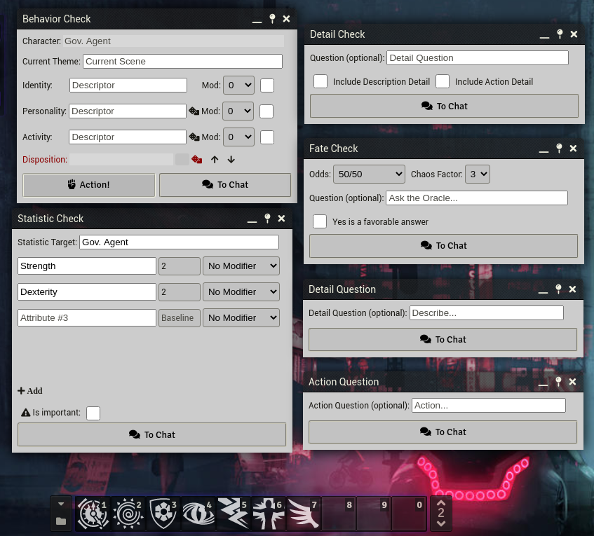

#### The Crafter Series

Macros for the **Randomized Locations Crafter**, inspired in the Mythic Magazine 2 are available to be used.
You can track Progress Points and use any of your own tables to follow the logic described by either The Location Crafter or The Randomized Version from the Magazine.

**TABLES NOT INCLUDED:** As a Matter of Principle, I prefer not to include the crafter tables, as the crafter series are already beyond the original scope of the module :)

Creating the random tables by yourself is relatively straight forward, use Nested tables to achieve the Special and Random Results, and even the Known if you have your own Random Tables!

Check my video to learn how to very fast ingest tables into Foundry: https://www.youtube.com/watch?v=-28Nks44SfM 

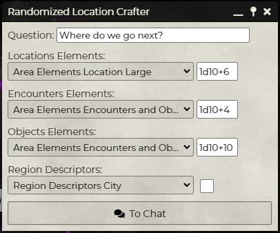

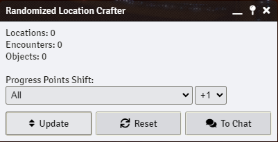

### Mythic Play Journals
Find these two pre-built journals within the compendium and play Mythic from there!

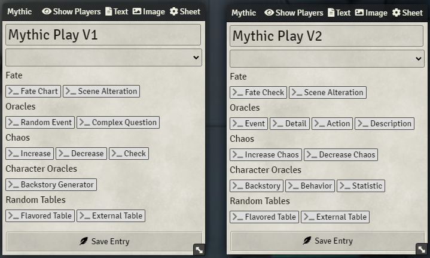

### The Oracle Builder
Create your own Oracles with Random Tables, supporting multiple draws per tables and flavor dialogues
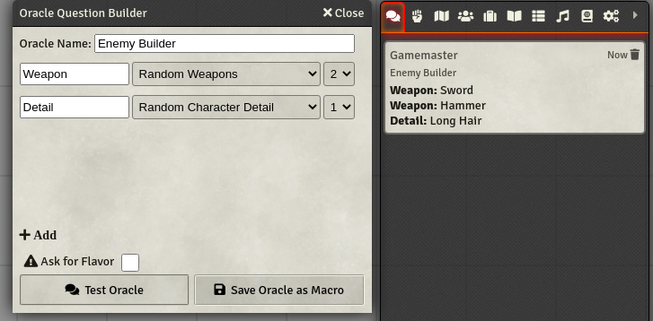

### Rolling your own tables
Either from Foundry Random Tables or Tables you have outside (printed, or in a PDF, etc), these macros will help you stay sharp and consistent!

#### Flavored Roll Table

Keep chat consistency by rolling from a Random Table normally with a question (flavor) in mind

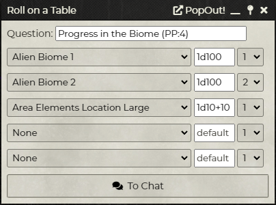

#### External Roll Table

Keep chat and overall consistency by rolling tables outside your game as if they belonged here!

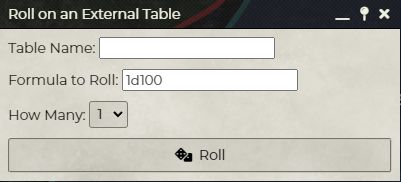

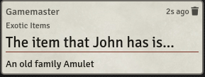

### Chat and Exporting

#### General Features

* Every Mythic check in Mythic GME Tools produces a flavored, self-explanatory chat message.
* A setting **Automatic Adventure Logging** (default: disabled) exports all oracle checks **to a journal entry**.
* Resize sidebar for a bigger chat place with [Sidebar Resizer](https://github.com/saif-ellafi/foundryvtt-sidebar-resizer)
* A macro **Export Chat to Journal** allows dumping the current chat into a Journal Entry with a single click.
* Rolling dice with Dice so Nice! module enabled will flavor and slowly produce results as the 3D dice give away their outcomes.

This will help keep track of your emulator's guidance and your game!

 

#### Formatted Message - Send message to the chat with flavor, color and style

Keep your game chat log clear and consistent, add headers, subtitles, and more


#### Exporting your game
Export current Chat to Journal - Either for backup or for history tracking. You can do this in two ways:

* By using the Macro to export current Chat to a Journal Entry
* By enabling Auto-Logging setting that automatically puts all your chat in a daily journal

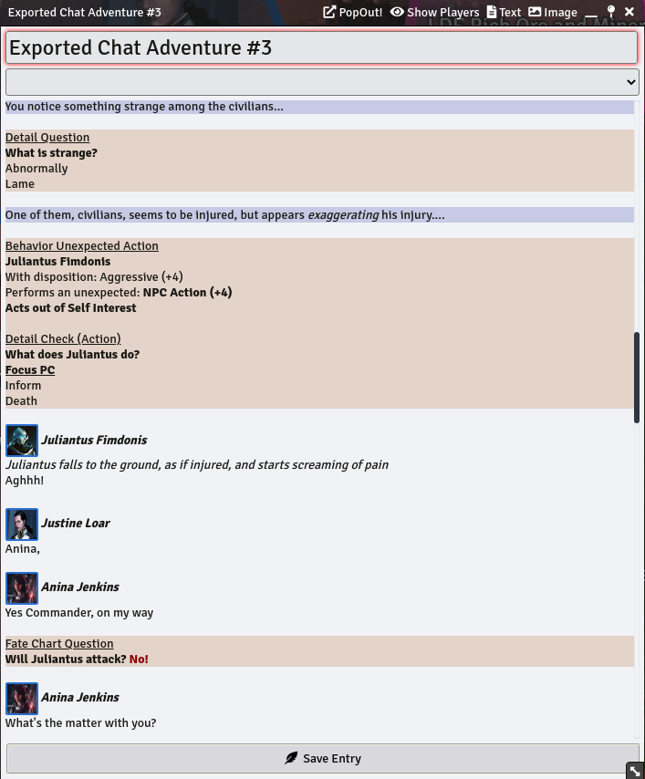

### Customizing your playstyle

Tables necessary to execute the aforementioned macros are included, and may also be used independently.

**Macros use Roll Tables**. Going to **Module Settings** lets you choose which tables are being used. Table names must begin
with **Mythic** in order to be eligible. By default, Macros pick up Tables **by their name**, so also importing the  Tables
from the Compendium and making modifications on them, will automatically apply to the Macros looking for them.
Try to keep the same format of the tables to avoid issues. Delete imported tables to revert Macros to use the original ones.

### Saved Progress

* Chaos Rank: When changing Chaos Rank, the value will be saved and reused across all functions
* Behavior Actor Disposition: Tokens and Actors on which Behavior Check was used, will save their information in your game.
Running Behavior Checks on the same tokens will bring up their current disposition data!
* Statistic Checks Macro will store the last utilized Attributes for more convenience playthrough!

### Configurable Settings
* Minimum and Maximum Chaos Rank is configurable
* Custom color for Chaos Die in Variations #2
* Optional setting rules from Variations #1 and #2
* Globally select Focus, subject, action and descriptor tables for all Macros (i.e. for a Variations #1 Theme)
* Automatic logging into Journal Entries
* Configure different levels of speed and tension when interacting with 3D Dice (Dice so Nice!)

### Card Decks

**NOTE** - Deck Images are not included and can be purchased from DriveThruRPG or similar outlets.

#### Overview

* Includes presets for GME Deck, TAC Deck and the GMA Decks
* Configure your Deck folder for the Macros to be able to pull them into the game (See instructions below)
* Optionally rotate cards feature (Mythic and TAC need this) - **Note: Must be changed within the Macro Script**
* Toggle shuffle off if required - **Note: Must be changed within the Macro Script**
* Set image file type to match your card image files. - **Note: Must be changed within the Macro Script**
  
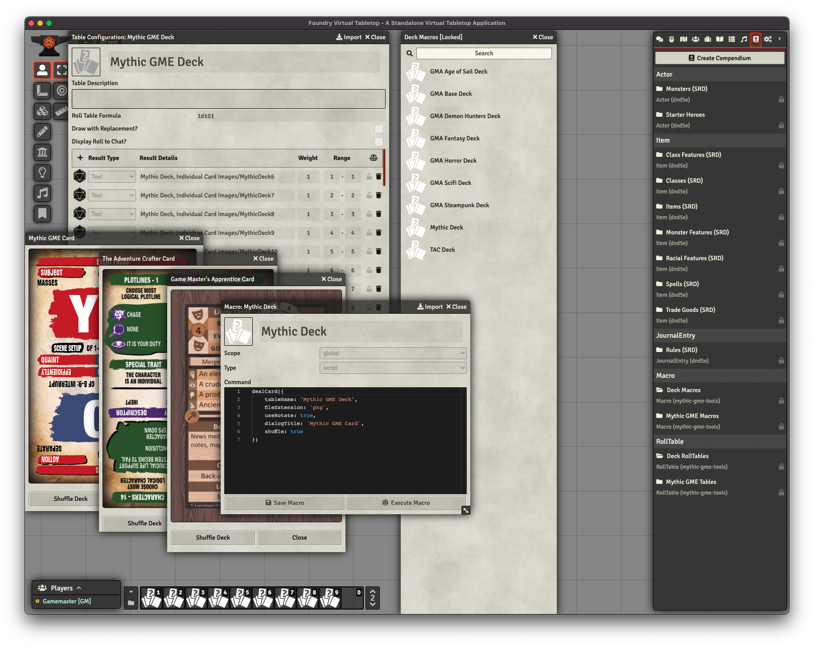

#### How to use

1. Install and Enable Mythic GME Tools in FoundryVTT
2. Enter any game (This module is system agnostic!)
3. Go to Compendiums, right click on Mythic GME Macros, Import All Content
4. Roll Tables can be used either directly from the Compendium, or imported along your other Roll Tables
5. [Optional] Using Decks (Cards not included) - Thank you stargolum/spacegiant) !!!
    1. Get a copy of
       cards [Mythic GME Cards](https://www.drivethrurpg.com/product/257195/Mythic-Game-Master-Emulator-Deck)
       or [TAC Cards](https://www.drivethrurpg.com/product/125685/The-GameMasters-Apprentice-Base-Deck) (check the macro
       list for a precise list of supported decks)
    2. Download the ZIP files of the decks you want to use
    3. Go to the folder "Data" from Foundry. This is where you have folders like `modules`, `systems` and `worlds`.
    4. Create a folder called `decks` exactly there along these other folders.
    5. Go inside the `decks` folder you just created and put the purchased .ZIP file there
    6. Right-click on the ZIP and press "Extract Here". Leave everything as is, make sure no folder names are duplicated
       when you extract it.
    7. Import mythic deck Macros for your preset game (or use these as guidance)
    8. If everything works, you can delete the zip file from there. It is not needed.
5. Say thanks if you like this :)

## Tips and Tricks and Modules
Playing without a GM, Solo or story telling in Foundry requires some practice. The following tips might boost your learning process.

### Learn to use Foundry's Chat
Try this on the chat:
```
Plot Point 1: [[1d100]]
Plot Point 2: [[1d100]]
<b>Plot Point 3:</b> [[1d100]]
Plot Point 4: [[1d100]]
Plot Point 5: [[1d100]]
```
The dice formula within double brackets on each side will roll for you the dice and print it alongside the rest of the text. With `Shift+Enter` you can insert new lines on the same chat dialogue. The `<b>text</b>` styling format will give you a **bold** text! Check out some other basic tags like `<em>...</em>` for italic format or `<h2>...</h2>` for subtitles. Check for more tags [here](https://www.w3schools.com/html/html_formatting.asp)

### Install Inline Table Rolls module
With `Inline Table Rolls` module, you can do the same of the above, but including drawing from random tables, look:
```
Plot Point 1: [[1d100]] - Theme: [[#Plotline Theme]]
Plot Point 2: [[1d100]] - Theme: [[#Plotline Theme]]
Plot Point 3: [[1d100]] - Theme: <b>[[#Plotline Theme]]</b>
Plot Point 4: [[1d100]] - Theme: [[#Plotline Theme]]
Plot Point 5: [[1d100]] - Theme: [[#Plotline Theme]]
```

### Recommended companion modules

This is an opinionated list of other Foundry VTT modules that may improve your experience and play well together with Mythic GME Tools and Solo in General

* [Dice so Nice](https://foundryvtt.com/packages/dice-so-nice) - Adds 3D Dice. Mythic GME Tools makes use of them improving the dice rolling experience
* [Sidebar Resizer and Chat Editor](https://foundryvtt.com/packages/sidebar-resizer) - Make the Chat bigger and add styles in real time
* [Drag Anything to Hotbar](https://foundryvtt.com/packages/drag-all-to-hotbar) - Drag & Drop characters, journal entries and roll tables, to have handy
* [PDFoundry](https://foundryvtt.com/packages/pdfoundry) - Not only it enables PDF journal entries, but also works with form-fillable PDFs!
* [Inline Table Rolls](https://foundryvtt.com/packages/inline-table-rolls) - Allows for rolling on random tables within chat messages just like dice [[#Table Name]]
* [GM Screen](https://foundryvtt.com/packages/gm-screen) - Have your favorite journal entries handy. Some players place Macros and Random Tables there for quick access.
* [Quick Insert](https://foundryvtt.com/packages/quick-insert) - Find things quickly and insert them in the chat or in a journal as a link
* [Terrain Randomizer](https://foundryvtt.com/packages/terrain-randomizer) - If you are into Solo tools in general, this one is for generating area layouts
* [Dice Tray](https://foundryvtt.com/packages/dice-calculator) - For quick dice rolling, adds above the chat a bar of multiple dice types, handy.
* [EasyTable](https://foundryvtt.com/packages/EasyTable) - If you have random tables in text format or got Regex skills, quickly load random tables into Foundry
* [Chat Portrait](https://foundryvtt.com/packages/chat-portrait) - If you play with actors that have token images, this will show such portraits in the chat

### Other modules of mine

* [Minimal UI](https://github.com/saif-ellafi/foundryvtt-minimal-ui) - Snappier User Interface
* [Window Controls](https://foundryvtt.com/packages/window-controls) - Pin and minimize windows, will help organizing all those open journal entries
* [Scene Preview](https://github.com/saif-ellafi/foundryvtt-scene-preview) - Preview Scenes before moving across to them
* [Actor Link Indicator](https://github.com/saif-ellafi/foundryvtt-actor-link-indicator) - Indicate whether Actors spawn linked Tokens
* [Super Select](https://github.com/saif-ellafi/foundryvtt-super-select) - Select Tiles, Drawings and Tokens without switching controls

## Author

This module is developed by me (Saif Ellafi - JeansenVaars) independently, and I hold no business relationship with Word
Mill Games. I (Saif Ellafi / @JeansenVaars) was given PERMISSION by Tana Pigeon to distribute this package UNDER STRICT
CONSENT of non-commercial distribution within Foundry VTT only.

However you can still [Invite me to a Coffee](#by-jeansenvaars) :) if you enjoy my work!

### By JeansenVaars


[](https://ko-fi.com/V7V14D3AH)

### Contributors

Thanks to [spacegiant](https://github.com/spacegiant) (GitHub username) - We can enjoy a set of Macros destined to use
Mythic Cards Deck as well as The GameMaster's Apprentice.

The decks **ARE NOT INCLUDED**, thus must be purchased
separately: [Mythic GME Deck](https://www.drivethrurpg.com/product/257195/Mythic-Game-Master-Emulator-Deck)
and [TAC](https://www.drivethrurpg.com/product/125685/The-GameMasters-Apprentice-Base-Deck)

### Community

Special thanks to the Community at the Discord Channel from [Mythic Game Master Emulator](https://discord.gg/hyHUuZEt)
for the support

### Powered By

[](https://www.jetbrains.com)

Thanks to JetBrains I can work on this project using **WebStorm**.

## License

[Custom License](./LICENSE.md)
