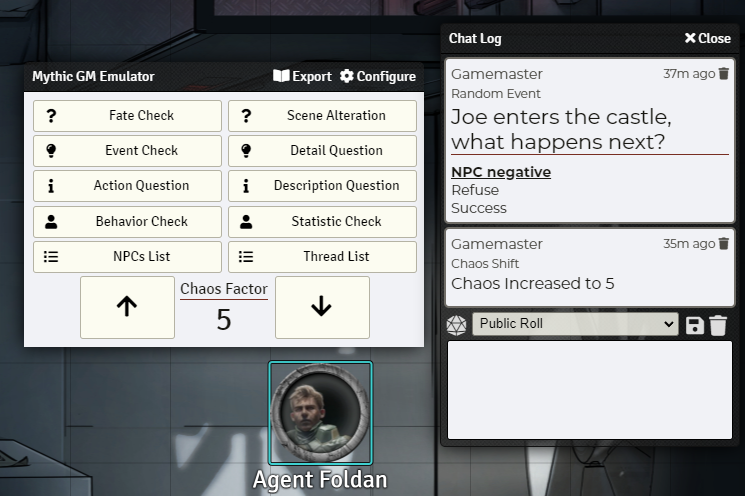
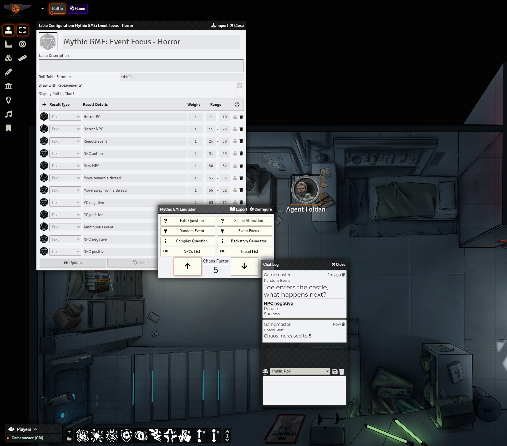
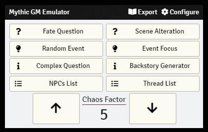
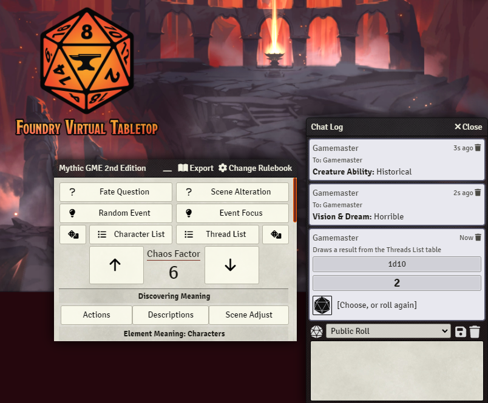
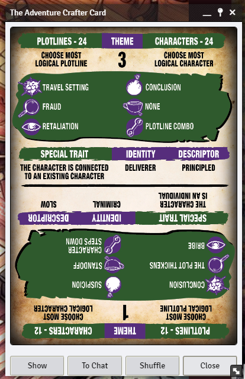
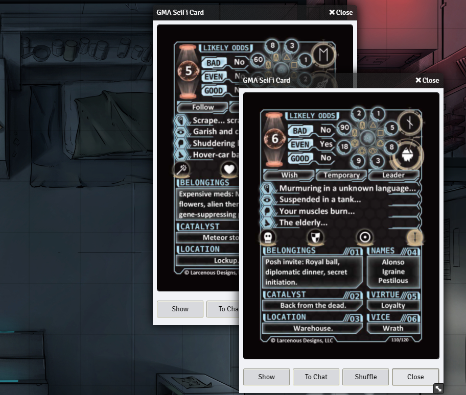
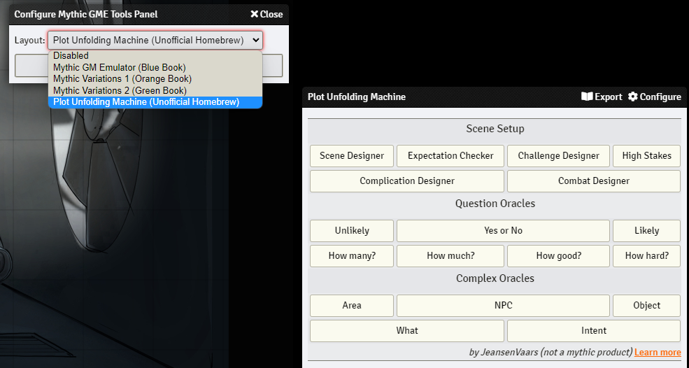

   
# Mythic GME Tools for FoundryVTT

Mythic GME Tools provides everything needed for playing Solo and GM-Less games with Mythic GM Emulator and other GM Emulators with any RPG System in Foundry VTT.

**Mythic rulesets**: Mythic (Blue Book), Mythic Variations 1, Mythic Variations 2, Mythic 2nd Edition

**Other rulesets**: Game Apprentice Cards, The Adventure Crafter Cards, Plot Unfolding Machine, Game Unfolding Machine, Tricube Tales Countdown Cards

### _Created by: JeansenVaars_

### [This module was made for free, with love, hard work and tons of coffee!](https://ko-fi.com/jeansenvaars)

# Table of Contents
1. [Word Mill Games - License](#word-mill-games)
2. [How to play](#how-to-play)
3. [Features](#features)
   1. [Overview](#overview)
   2. [Mythic GME Tools Panel](#mythic-gme-tools-panel)
   3. [Mythic GM Emulator Rulesets](#mythic-gm-emulator-rulesets)
      1. [GM Emulator 2nd Edition](#gm-emulator-2nd-edition)
      2. [GM Emulator Blue Book](#gm-emulator-blue-book)
      3. [Variations 1 Orange Book](#variations-1-orange-book)
      4. [Variations 2 Green Book](#variations-2-green-book)
      5. [Adventure Crafter Cards](#adventure-crafter-cards)
   4. [Other GM Emulator Rulesets](#other-gm-emulator-rulesets)
      1. [The GameMaster's Apprentice](#the-gamemasters-apprentice)
      2. [Plot Unfolding Machine](#plot-unfolding-machine)
      3. [Game Unfolding Machine](#game-unfolding-machine)
      4. [Tricube Tales Countdown Cards](#tricube-tales-countdown-cards)
   5. [The Oracle Builder](#the-oracle-builder)
   6. [Rolling your own Tables](#rolling-your-own-tables)
   7. [Chat and Exporting](#chat-and-exporting)
   8. [Customizing your Playstyle](#customizing-your-playstyle)
   9. [Saved Progress](#saved-progress)
   10. [Card Decks](#card-decks)
4. [Tips and Tricks](#tips-and-tricks)
5. [Author](#author)
6. [License](#license)

## Word Mill Games

**Mythic GM Emulator Rulebook** is _REQUIRED_ to understand this material. Variations 1 and 2 are needed as well, respectively for their mechanics.

Mythic Game Master Emulator is property of [Word Mill Games](https://www.wordmillgames.com) and this module is distributed with permission of author **Tana Pigeon**.

May not be commercially redistributed. Offered for free (Donations permitted and welcome to the author of this module).

[Get Mythic GME Books](https://www.wordmillgames.com/)

### Special Appreciations!
* **Tana Pigeon** for authorizing the distribution of this module, based on the wonderful Mythic Books
* **stargolem** for DECKs support to play with Mythic and GMA Cards, as well for the positive feedback and panels UI
* **KarstenW** for providing German Translations
* **FoundryVTT Discord, Die Gießerei and Mythic Discord communities** for supporting with my terrible coding skills and crazy ideas
* Everyone who appreciates and enjoys this material

## How to play

**Starting from 2.5.0+**, Mythic GME Tools automatically opens a panel with all mechanics ready to be played from the get-go. No setup required.

This modules provides all mythic rules in the form of Macros. You can use them in whatever RPG system you like in any world.

**To manually import Macros**, enable the module, and then go to the Compendiums tab, you are going to see many compendiums starting with the word **Mythic**. For starters, the most basic one is **Mythic GME Macros**.
Simply drag and drop them to your Macro Hotbar at the bottom of the screen. Then, just click on them and play!

### Video example

## Features

### Overview

* One-Click Macros for multiple GM Emulator rulesets: Mythic GM Emulator, GameMaster's Apprentice, Plot Unfolding Machine, and more
* Saves Mythic's progress for Chaos Level, Behavior Disposition, Statistic Checks
* Customize roll tables, focus tables, and much more to set up your favorite GM-Less experience
* Built-in Support for **Dice so Nice!** taking 3D dice to a flavor-narrative oriented experience
* All Actions translate into the chat for keeping a **history of your game**. This may also be exported to a Journal.
* Everything is configurable through Mythic GME Tools module settings (such as Focus Tables, and more)
* Support for non-Mythic solo games too (Such as my Plot Unfolding Machine and Tricube Tales Countdown cards)

### Mythic GME Tools Panel

The main panel of this module allows you to play your favorite GM emulator ruleset with ease.

Click on **Configure** to switch to alternate GM emulators, and **Export** will let you export Chat to Journal.

### Mythic GM Emulator Rulesets
These macros provide complex functionalities summarized in a one-click event.
Most of them bring up a Dialog in which the player customizes or elaborates the event.

Selecting a Token will cause the Macros to interact with a Foundry VTT actor, 
speak on his behalf or even sometimes use its information for better flavor!

#### GM Emulator 2nd Edition
* Discovery meaning tables
* Scene adjustment table
* Weighted lists support
* Element meaning tables included

#### GM Emulator Blue Book
* Fate Chart: Rolls on the Fate Chart. Triggers Random Events when appropriate.
* Random Event: Generates a random event.
* Scene Alteration: Checks if the proposed event is still valid. Rolls Random Events when appropriate.
* Increase Chaos Rank
* Decrease Chaos Rank
* Check Chaos Rank

#### Variations 1 Orange Book
* Complex Questions
* Backstory Generator

#### Variations 2 Green Book
* Fate Check
* Event Check
* Detail Check
* Description Question
* Action Question
* Behavior Check - Advanced: This Macro stores disposition information within Tokens!
* Statistic Check - Advanced: This Macro stores the last used Attributes in your game!

#### Adventure Crafter Cards

Drag and Drop the TAC Deck Macro to your hotbar, to pop up adventure crafter cards.

### Other GM Emulator Rulesets

#### The GameMaster's Apprentice

Check out the cards section to learn how to configure them.

#### Plot Unfolding Machine

This Solo system can be played with Mythic or on its own, and it focuses on placing your PCs into action, Scene by Scene. [HERE](https://jeansenvaars.itch.io/plot-unfolding-machine) :)

Check it out if getting stuck in your Solo or GMLess games is an often-issue, because PUM is designed to help with Scene Setup proposals.

#### Game Unfolding Machine

This GM Emulator is action driven and focuses on getting you started with a solo adventure [HERE](https://jeansenvaars.itch.io/game-unfolding-machine) :)

Check it out if you'd like to try something different in your adventures.

#### Tricube Tales Countdown Cards

Check out the cards section to learn how to configure them.

### The Oracle Builder
Create your own Oracles with Random Tables, supporting multiple draws per tables and flavor dialogues

### Rolling your own tables
Either from Foundry Random Tables or Tables you have outside (printed, or in a PDF, etc), these macros will help you stay sharp and consistent!

#### Flavored Roll Table

Keep chat consistency by rolling from a Random Table normally with a question (flavor) in mind

#### External Roll Table

Keep chat and overall consistency by rolling tables outside your game as if they belonged here!

### Chat and Exporting

#### General Features

* Every Mythic check in Mythic GME Tools produces a flavored, self-explanatory chat message.
* A setting **Automatic Adventure Logging** (default: disabled) exports all oracle checks **to a journal entry**.
* Resize sidebar for a bigger chat place with [Sidebar Resizer](https://github.com/saif-ellafi/foundryvtt-sidebar-resizer)
* A macro **Export Chat to Journal** allows dumping the current chat into a Journal Entry with a single click.
* Rolling dice with Dice so Nice! module enabled will flavor and slowly produce results as the 3D dice give away their outcomes.

This will help keep track of your emulator's guidance and your game!

 

#### Formatted Message - Send message to the chat with flavor, color and style

Keep your game chat log clear and consistent, add headers, subtitles, and more

#### Exporting chat records to a Journal Entry
You can do this in three ways:

* By clicking on Export in the Mythic Panel
* By using the Macro to export current Chat to a Journal Entry
* By enabling Auto-Logging setting that automatically puts all your chat in a daily journal

### Customizing your playstyle

There are plenty of configuration options. Go to **Module Settings** in Foundry and check the Mythic GME Tools section!

Tables necessary to execute the aforementioned macros are included, and may also be used independently.

**Macros use Roll Tables**. Going to **Module Settings** lets you choose which tables are used. Table names must begin
with **Mythic** in order to be eligible. By default, Macros pick up Tables **by their name**, so importing the Tables
from the Compendium and making modifications on them, will automatically apply to the Macros that use them.
Try to keep the same format of the tables to avoid issues. Delete imported tables to revert Macros to use the original ones.

### Saved Progress

* Chaos Rank: When changing Chaos Rank, the value will be saved and reused across all functions
* Behavior Checks: Disposition and descriptors are stored within actor tokens, by selecting the token before running the Macro.
* Statistic Checks: Stats are stored within actor tokens, by selecting the token before running the Macro.

### Card Decks

**NOTE** - Deck Images are not included and can be purchased from DriveThruRPG or similar outlets.

#### Supported Decks

Simply unzip the files as they are, into the `decks` folder in your `Data` folder of FoundryVTT.

* [Mythic Game Master Emulator Deck](https://www.drivethrurpg.com/product/257195/Mythic-Game-Master-Emulator-Deck)
* [The Adventure Crafter Deck](https://www.drivethrurpg.com/product/303881/The-Adventure-Crafter-Deck)
* [GMA Base Deck](https://www.drivethrurpg.com/product/125685/The-GameMasters-Apprentice-Base-Deck)
* [GMA Fantasy Deck](https://www.drivethrurpg.com/product/213131/The-GameMasters-Apprentice-Fantasy-Deck)
* [GMA Horror Deck](https://www.drivethrurpg.com/product/167552/The-GameMasters-Apprentice-Horror-Deck)
* [GMA SciFi Deck](https://www.drivethrurpg.com/product/156198/The-GameMasters-Apprentice-Sci-Fi)
* [GMA Steampunk Deck](https://www.drivethrurpg.com/product/176739/The-GameMasters-Apprentice-Steampunk-Deck)
* [GMA Age of Sail Deck](https://www.drivethrurpg.com/product/187419/The-GameMasters-Apprentice-Age-of-Sail-Deck)
* [GMA Demon Hunters Deck](https://www.drivethrurpg.com/product/155835/The-GameMasters-Apprentice-Demon-Hunters)
* [Saga of the Goblin Horde](https://www.drivethrurpg.com/product/244819)
* [Countdown Galactic](https://www.drivethrurpg.com/product/249100)
* [Countdown Monster](https://www.drivethrurpg.com/product/249101)
  

#### How to use

1. Install Decks (Cards not included in module)
    1. Get any of the supported cards from DriveThruRPG
    2. Download the ZIP files of the decks you want to use
    3. Go to the folder "Data" from Foundry. This is where you have folders like `modules`, `systems` and `worlds`.
    4. Create a folder called `decks` exactly there along these other folders.
    5. Go inside the `decks` folder you just created and put the purchased .ZIP file there
    6. Right-click on the ZIP and press "Extract Here". Leave everything as is, make sure no folder names are duplicated
       when you extract it.
    7. If everything works, you can delete the zip file from there. It is not needed.
2. Enable the module in a game world, and go to Compendiums Tab
3. Open `Mythic Deck Macros` and Drag and Drop the ones you want, to the Macro Hotbar
4. [Optional] Import `Mythic Deck Tables` from Compendium if you want to draw cards without replacement
5. Say thanks if you like this, particularly to `Stargolum` :)

## Tips and Tricks
Playing without a GM, Solo or story telling in Foundry requires some practice. The following tips might boost your learning process.

### Recommended companion modules

This is an opinionated list of other Foundry VTT modules that may improve your experience and play well together with Mythic GME Tools and Solo in General

* [Dice so Nice](https://foundryvtt.com/packages/dice-so-nice) - Adds 3D Dice. Mythic GME Tools makes use of them improving the dice rolling experience
* [Sidebar Resizer and Chat Editor](https://foundryvtt.com/packages/sidebar-resizer) - Make the Chat bigger and add styles in real time
* [Roll Tables from Sidebar](https://foundryvtt.com/packages/rolltable-from-sidebar) - Roll tables faster without having to open them
* [Drag Anything to Hotbar](https://foundryvtt.com/packages/drag-all-to-hotbar) - Drag & Drop characters, journal entries and roll tables, to have handy
* [PDFoundry](https://foundryvtt.com/packages/pdfoundry) - Not only it enables PDF journal entries, but also works with form-fillable PDFs!
* [Quick Insert](https://foundryvtt.com/packages/quick-insert) - Find things quickly and insert them in the chat or in a journal as a link
* [Dice Tray](https://foundryvtt.com/packages/dice-calculator) - For quick dice rolling, adds above the chat a bar of multiple dice types, handy.
* [Chat Portrait](https://foundryvtt.com/packages/chat-portrait) - If you play with actors that have token images, this will show such portraits in the chat

### Other modules of mine

* [Minimal UI](https://github.com/saif-ellafi/foundryvtt-minimal-ui) - Snappier User Interface
* [Window Controls](https://foundryvtt.com/packages/window-controls) - Pin and minimize windows, will help organizing all those open journal entries
* [Clipboard Image](https://foundryvtt.com/packages/clipboard-image) - Quickly copy-paste images into the Foundry canvas map
* [Scene Preview](https://github.com/saif-ellafi/foundryvtt-scene-preview) - Preview Scenes before moving across to them
* [Actor Link Indicator](https://github.com/saif-ellafi/foundryvtt-actor-link-indicator) - Indicate whether Actors spawn linked Tokens
* [Super Select](https://github.com/saif-ellafi/foundryvtt-super-select) - Select Tiles, Drawings and Tokens without switching controls

## Author

This module is developed by me (Saif Ellafi - JeansenVaars) independently, and I hold no business relationship with Word
Mill Games. I (Saif Ellafi / @JeansenVaars) was given PERMISSION by Tana Pigeon to distribute this package UNDER STRICT
CONSENT of non-commercial distribution within Foundry VTT only.

However you can still [Invite me to a Coffee](#by-jeansenvaars) :) if you enjoy my work!

### By JeansenVaars

### Powered By

Thanks to JetBrains I can work on this project using **WebStorm**.

## License

[Custom License](./LICENSE.md)
