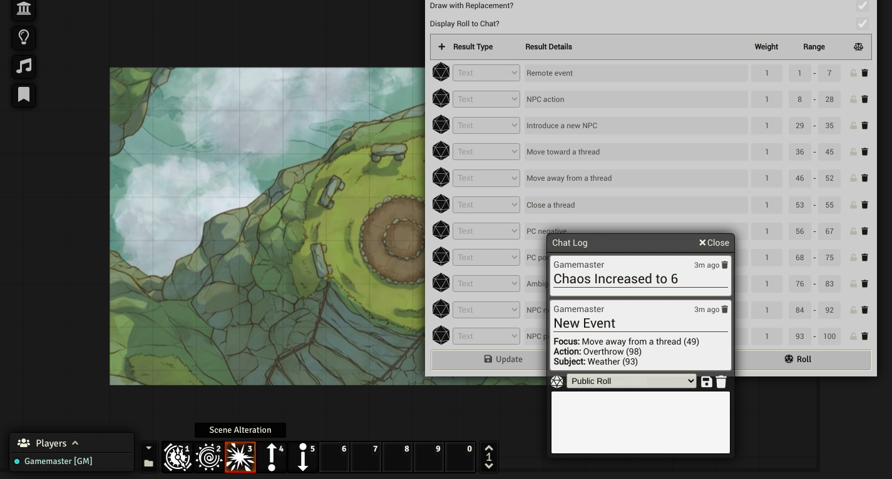
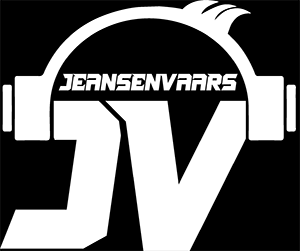

# Mythic GME Tools for FoundryVTT

Provides Script Macros and Roll Tables for Playing any RPG system with Mythic GM Emulator

## Credits and Attributions

Mythic GM Emulator Rulebook is required to use and understand this content.

All attributions belong to [WORD MILL GAMES](https://www.wordmillgames.com) and this module is redistributed with appropriate permission from author **Tana Pigeon**

[Get Mythic GME Book](https://www.drivethrurpg.com/product/20798/Mythic-Game-Master-Emulator)

[Other fantastic Word Mill Games material](https://www.drivethrurpg.com/browse/pub/480/Word-Mill)

This module is developed by me (Saif Ellafi - JeansenVaars) independently, and hold no business relationship with World Mill Games. Freely distributed non-commercially within Foundry VTT only.

[Invite me to a Coffee](#by-jeansenvaars) (Ko-Fi) if you like my work!

## Features

* Scripts for rolling Fate Charts, Random Event and Scene Chaos Checks
* Persistently records current Chaos Rank
* Allows Increasing and Decreasing Chaos Rank with a button
* Roll Tables for manual use in Foundry
* Configuration to point to custom Roll Tables to the Macros to customize your fate

### Functions
* Remembers Chaos Rank: When changing Chaos Rank with the Macro, the value will be persisted and used as default for other macros!

### Macros
* Increase Chaos Rank
* Decrease Chaos Rank
* Fate Chart: Rolls on the Fate Chart. Triggers Random Events when appropriate.
* Random Event: Generates a random event.
* Scene Alteration: Checks if the proposed event is still valid. Rolls Random Events when appropriate.

### Roll Tables
* Event Focus
* Action Meaning
* Subject Meaning

## How to use
1. Install Mythic GME Tools from FoundryVTT module installer
2. Enable Mythic GME Tools module in FoundryVTT
3. Enter any game (This module is system agnostic!)
4. Go to Compendiums and import all Macros to your Macro Bar to use them
5. Roll Tables can be used either directly from the Compendium, or imported along your other Roll Tables
6. Say thanks if you like this :)

**Note #1** - You may customize or change the probabilities of the Roll Tables, the will be used so long the keep the same name.

**Note #2** - You may copy the tables under different names. In settings you can point which tables you would like to use in your macros.

## To do

* Mythic Variations #1
* Mythic Variations #2
* Optional Rules and Magazine Variations

## By JeansenVaars

## Check out my other modules!
* [Minimal UI](https://github.com/saif-ellafi/foundryvtt-minimal-ui)
* [Window Controls](https://github.com/saif-ellafi/foundryvtt-window-controls)
* [Scene Preview](https://github.com/saif-ellafi/foundryvtt-scene-preview)
* [Super Select](https://github.com/saif-ellafi/foundryvtt-super-select)

# License
[MIT License](./LICENSE.md)

# Powered By

Thanks to JetBrains I can work on this project using **WebStorm**.
